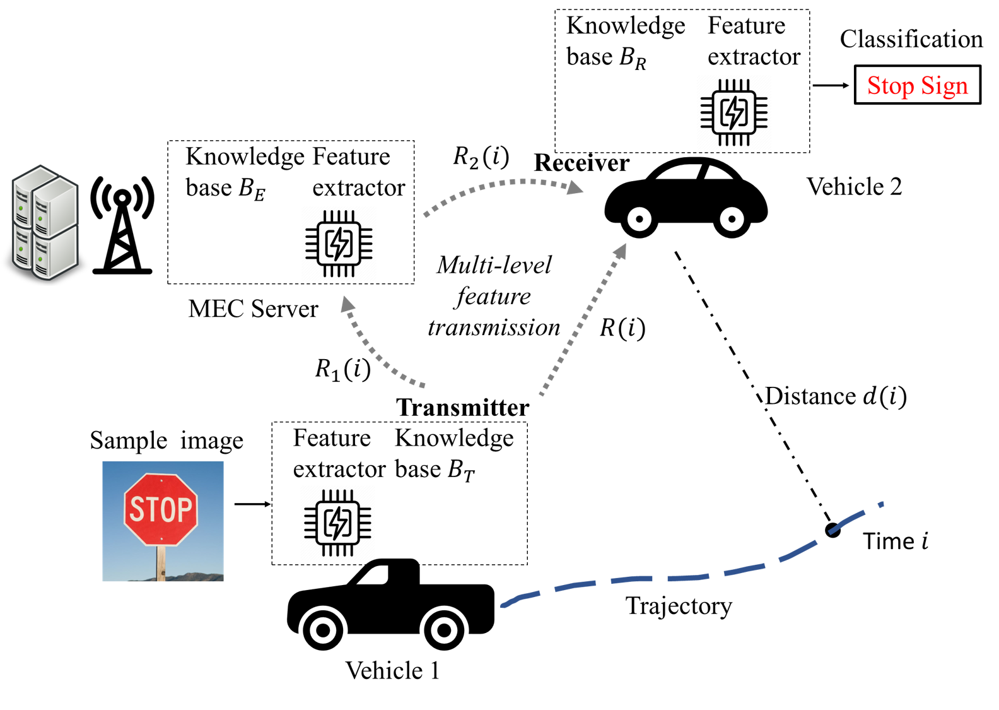

# Multi-Level Feature Transmission in Dynamic Channels: A Semantic Knowledge Base and Deep Reinforcement Learning-Enabled Approach
A Deep-Reinforcement Learning Approach for Intelligent Multi-Level Feature Transmission for Remote Object Recognition.

<p align="center">  </p>

> [**Multi-Level Feature Transmission in Dynamic Channels: A Semantic Knowledge Base and Deep Reinforcement Learning-Enabled Approach**](https://www.techrxiv.org/users/831907/articles/1225652-multi-level-feature-transmission-in-dynamic-channels-a-semantic-knowledge-base-and-deep-reinforcement-learning-enabled-approach)            
> Xiangyu Gao, Hao Yin, Yaping Sun, Dongyu Wei, Xiaodong Xu, Hao Chen, Wen Wu, and Shuguang Cui <br />
> *[techrxiv technical report](https://www.techrxiv.org/users/831907/articles/1225652-multi-level-feature-transmission-in-dynamic-channels-a-semantic-knowledge-base-and-deep-reinforcement-learning-enabled-approach)*
> 
    @ARTICLE{10778255, author={Gao, Xiangyu and Yin, Hao and Sun, Yaping and Wei, Dongyu and Xu, Xiaodong and Chen, Hao and Wu, Wen and Cui, Shuguang},
    journal={IEEE Internet of Things Journal}, 
    title={Multi-Level Feature Transmission in Dynamic Channels: A Semantic Knowledge Base and Deep Reinforcement Learning-Enabled Approach}, 
    year={2024}, volume={}, number={}, pages={1-1},
    keywords={Semantics;Servers;Optimization;Feature extraction;Transmitters;Vectors;Receivers;Vehicle dynamics;Object recognition;Sun;Semantic knowledge base;online optimization;deep reinforcement learning;remote object recognition;multi-level feature transmission},
    doi={10.1109/JIOT.2024.3511592}}


## Update
***(March. 13, 2025) Release the source code and sample data.***

## Abstract
With the proliferation of edge computing, efficient AI inference on edge devices has become essential for intelligent applications such as autonomous vehicles and VR/AR. In this context, we address the problem of efficient remote object recognition by optimizing feature transmission between mobile devices and edge servers. We propose an optimization framework to tackle the challenges posed by dynamic channel conditions and device mobility in end-to-end communication systems. Our approach builds upon existing methods by leveraging a semantic knowledge base to drive multi-level feature transmission, accounting for temporal factors, state transitions, and dynamic elements throughout the transmission process. Additionally, we enhance the multi-level feature transmission policy by introducing an additional 5th-level edge-assisted semantic communication, which maximizes recognition performance by leveraging a large SKB on the edge server. Formulated as an online optimization problem, our framework aims to simultaneously minimize semantic loss and adhere to specified transmission latency thresholds. To achieve this, we design a soft actor-critic-based deep reinforcement learning system with a carefully designed reward structure for real-time decision-making. This approach overcomes the optimization difficulty of the NP-hard problem while fulfilling the optimization objectives. Numerical results showcase the superiority of our approach compared to traditional greedy methods across various system setups using open-source datasets.

## Requirements
*   Python 3.8.18
*   Preferred system: Linux (Note that the format of directory in wins system might be different).
*   Pytorch-1.5.1
*   Other packages (refer to [`requirement`](requirements.txt))


## Default Arguments and Usage
### System Configuration
The configurations are in [`config`](config.py) file.

### Usage

```
usage: main.py [-h] [--env-name ENV_NAME] [--exp_name EXP_NAME] [--method METHOD] 
               [--policy POLICY] [--eval EVAL] [--eval_interval EVAL_INTERVAL] 
               [--skip_training SKIP_TRAINING][--gamma G] [--tau G] [--lr G] [--alpha G]
               [--automatic_entropy_tuning G] [--entropy_decay ENTROPY_DECAY] [--seed N] 
               [--batch_size N] [--num_steps N] [--hidden_size N] [--updates_per_step N]
               [--start_steps N] [--target_update_interval N] [--replay_size N] 
               [--cuda]
```

Note: There is no need for setting Temperature(`--alpha`) if `--automatic_entropy_tuning` is True.

#### For Running proposed DRL Algorithm
```
python main.py --automatic_entropy_tuning --cuda --exp_name test_run
```

#### For Running Baselines
* ***Loss-first Greedy***
```
python main.py --cuda --method greedy_loss --eval_interval 1 --skip_training
```
* ***Latency-first Greedy***
```
python main.py --cuda --method greedy_latency --eval_interval 1 --skip_training
```

#### For Visualizing Convergence Via Tensorboard
```
tensorboard --logdir=runs --host localhost --port 8088
```

#### Usage of Other Arguments

```
sac_joint_compute_push_cache Args

optional arguments:
  -h, --help            show this help message and exit
  --env-name ENV_NAME   Wireless Comm environment (default: MultiTaskCore)
  --exp_name EXP_NAME   Name of the running experiment (default: None)
  --method METHOD       Method name: drl, greedy_loss, greedy_latency, (default: drl)
  --policy POLICY       Policy Type: Gaussian | Deterministic (default:
                        Gaussian)
  --eval EVAL           Evaluates a policy a policy every 10 episode (default:
                        True)
  --eval_interval       Test per interval of training episode (default: 5)
  --skip_training       Skip the training process for heuristic algorithms (default: False)
  --gamma G             discount factor for reward (default: 0.99)
  --tau G               target smoothing coefficient(τ) (default: 0.005)
  --lr G                learning rate (default: 3e-4)
  --alpha G             Temperature parameter α determines the relative
                        importance of the entropy term against the reward
                        (default: 0.2)
  --automatic_entropy_tuning G
                        Automaically adjust α (default: False)
  --entropy_decay       decaying α (default: False)
  --seed N              random seed (default: 123456)
  --batch_size N        batch size (default: 256)
  --num_steps N         maximum number of steps (default: 5000001)
  --hidden_size N       hidden size (default: 256)
  --updates_per_step N  model updates per simulator step (default: 1)
  --start_steps N       Steps sampling random actions (default: 10000)
  --target_update_interval N
                        Value target update per no. of updates per step
                        (default: 1000)
  --replay_size N       size of replay buffer (default: 1000000)
  --cuda                run on CUDA (default: False)
```

## License

This codebase is released under MIT license (see [LICENSE](LICENSE)).

## Acknowledgement
This project is not possible without multiple great opensourced codebases. We list some notable examples below.  

* [sac_joint_compute_push_cache](https://github.com/Xiangyu-Gao/sac_joint_compute_push_cache)
* [pytorch-soft-actor-critic](https://github.com/pranz24/pytorch-soft-actor-critic)


